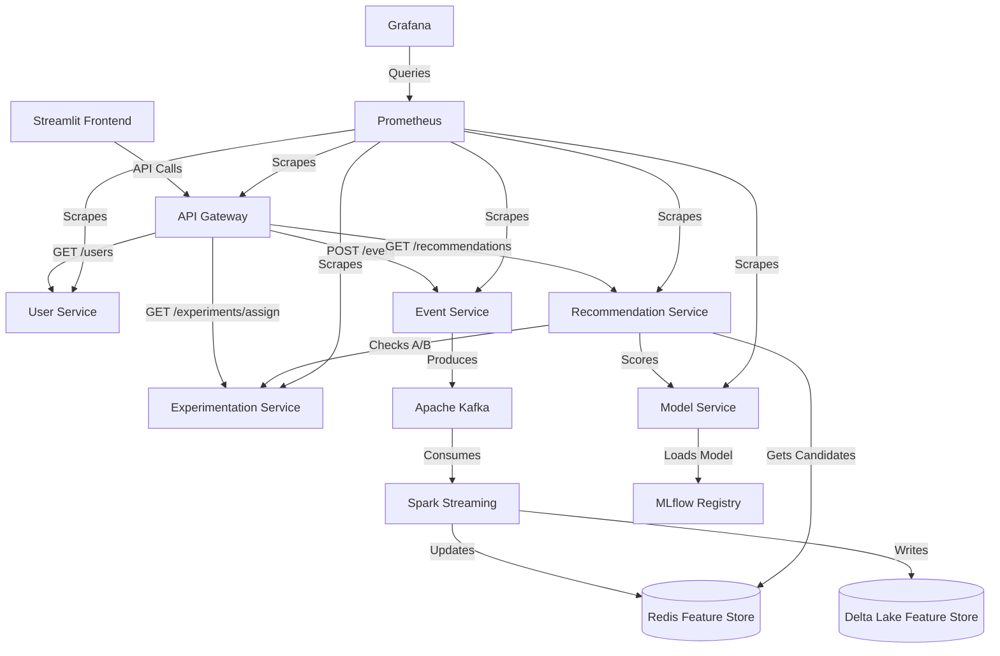

# Production-Grade Real-Time Recommendation System

A production-ready, highly scalable, and observable recommendation platform demonstrating a complete ML lifecycle. Built with a microservices architecture, real-time streaming pipelines, and Kubernetes deployment.

## 🏗️ Architecture Diagram



## 🧩 Microservices

The platform consists of several FastAPI microservices:

*   **API Gateway**: The central entry point for external traffic (Streamlit, mobile apps). Handles routing, aggregation, and coarse-grained rate limiting.
*   **User Service**: Manages user metadata, demographics, and historical interaction tracking.
*   **Event Service**: The ingestion layer. Receives clickstream data (clicks, views, ratings) and pushes to Kafka.
*   **Recommendation Service**: The orchestrator for the inference pipeline. Fetches candidates, joins features, queries the experimentation service, and calls the model service for final ranking.
*   **Model Service**: The high-throughput inference engine. Loads MLflow artifacts and executes predictions.
*   **Experimentation Service**: Manages deterministic A/B testing assignments to ensure consistent user experience across sessions.

## 🧪 A/B Testing Design

The platform includes a robust A/B testing framework:
*   **Deterministic Hashing**: User assignments are calculated using a SHA-256 hash of `user_id` + `experiment_id`, ensuring a user always sees the same variant.
*   **Dynamic Routing**: The Recommendation Service calls the Experimentation Service to determine which `model_version` should be used for scoring candidates.
*   **Tracking**: Metrics (CTR, engagement) are computed based on events that specify the active experiment group.

## 🔄 Online Learning

To adapt to rapidly shifting user behaviors between batch training cycles:
1.  **Streaming Features**: Spark Streaming consumes Kafka events and updates user interaction counters and rolling averages in the real-time feature store (Redis).
2.  **Incremental Embeddings**: We implement a closed-form Alternating Least Squares (ALS) update using the latest interaction vector ($r_u$) and static item factor matrix ($Y$).
3.  **Warm-Start Retraining Trigger**: Drift thresholds and event volumes are monitored. When thresholds are breached, a mock Airflow API call is triggered to initiate a warm-start ALS training job.

## 📡 Monitoring (Prometheus + Grafana + Evidently)

Full system observability is critical:
*   **Prometheus**: Scrapes `/metrics` endpoints across all microservices (latency, throughput, error rates) every 15s.
*   **Grafana**: Auto-provisioned dashboards for:
    *   API Performance (Latency, Error rates)
    *   System Health (CPU/Mem, Service Uptime)
    *   Kafka Monitoring (Consumer Lag, Msg Throughput)
    *   Model Performance (Inference latency by stage, Predictions/sec)
*   **Evidently**: Scheduled Python scripts monitor feature stores against training distributions to calculate `DataQualityPreset`, `DataDriftPreset`, and `TargetDriftPreset`.

## 🚀 Kubernetes Deployment Steps

The entire platform can be deployed to a Kubernetes cluster using the generated manifests in the `k8s/` directory.

1.  Ensure you have a running cluster (e.g., `minikube start`) and `kubectl` installed.
2.  Run the automated deployment script:
    ```bash
    bash k8s/deploy.sh
    ```
    This script will sequence the deployment:
    *   Namespace creation (`recsys`)
    *   Secrets and ConfigMaps
    *   Stateful Infrastructure (Kafka, Postgres, Redis, MLflow)
    *   Stateless Microservices (FastAPI, Streamlit, Monitoring)
    *   Horizontal Pod Autoscalers (HPA)
    *   Ingress Configuration
3.  Add `127.0.0.1 recsys.local` to your `/etc/hosts` file.
4.  Access the platform at `http://recsys.local` and Grafana at `http://recsys.local/grafana`.

## 📖 API Documentation

All microservices are built with FastAPI and expose Swagger UI documentation. 

*   **API Gateway**: `http://localhost:8000/docs`
*   **User Service**: `http://localhost:8001/docs`
*   **Event Service**: `http://localhost:8002/docs`
*   **Recommendation Service**: `http://localhost:8003/docs`
*   **Model Service**: `http://localhost:8004/docs`
*   **Experimentation Service**: `http://localhost:8005/docs`

## 📸 Screenshots

*(In a live repository, place images of the Streamlit Frontend, Grafana API Dashboard, and Evidently Drift Report here).*

*   ``
*   ``
*   ``
