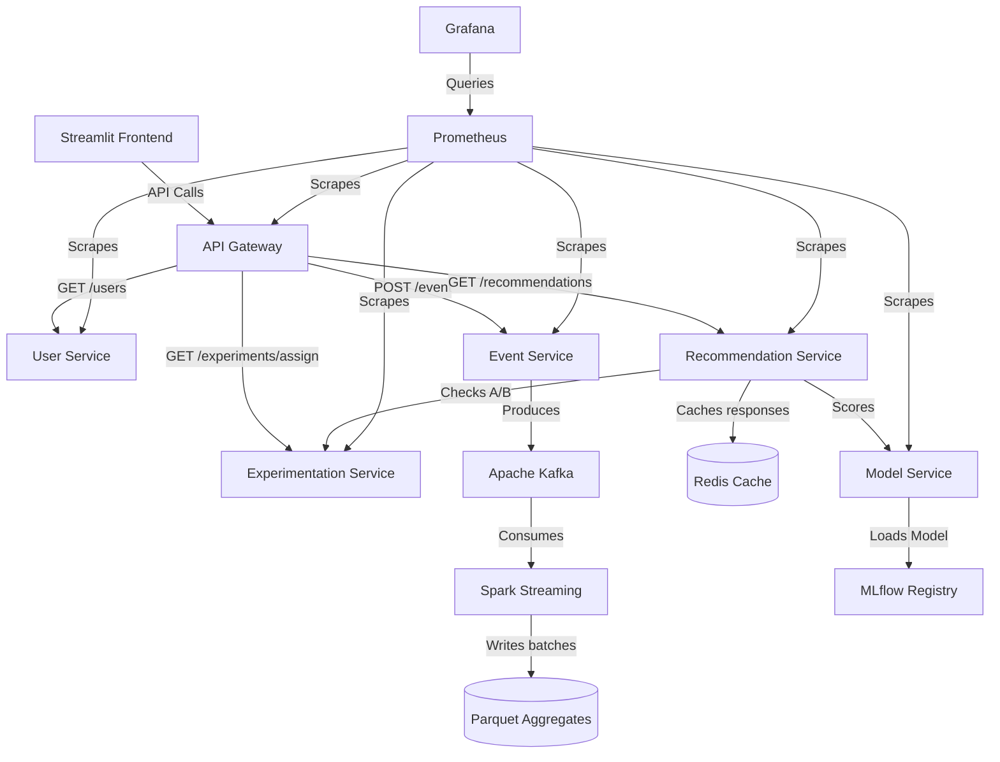

# Recommendation ML Platform — Engineering Prototype


A portfolio reference architecture with FastAPI services, Kafka event publishing, Spark streaming code, MLflow registry integration and Redis response caching. Individual components are implemented, but the full training-to-serving platform has not been verified as an integrated production deployment.

### Implementation status

Streaming feature persistence, online embedding persistence, retraining triggers and deployment automation are incomplete. Recommendation fallbacks return fixed items/scores when registered models are unavailable. Monitoring examples use synthetic data. The current default-branch CI run is failing, and some job commands mask failures with `|| echo`; successful job labels alone do not establish passing checks.

## 🏗️ Reference Architecture

Solid links below show code-level component relationships, not a verified running deployment.


```mermaid
graph TD
    UI[Streamlit Frontend] -->|API Calls| API[API Gateway]
    
    API -->|GET /users| US[User Service]
    API -->|POST /event| ES[Event Service]
    API -->|GET /recommendations| RS[Recommendation Service]
    API -->|GET /experiments/assign| ExpS[Experimentation Service]
    
    ES -->|Produces| Kafka[Apache Kafka]
    Kafka -->|Consumes| SparkS[Spark Streaming]
    SparkS -->|Writes batches| Parquet[(Parquet Aggregates)]
    
    RS -->|Caches responses| RedisCache[(Redis Cache)]
    RS -->|Checks A/B| ExpS
    RS -->|Scores| MS[Model Service]
    
    MS -->|Loads Model| MLflow[MLflow Registry]
    
    Prom[Prometheus] -->|Scrapes| API
    Prom -->|Scrapes| US
    Prom -->|Scrapes| ES
    Prom -->|Scrapes| RS
    Prom -->|Scrapes| MS
    Prom -->|Scrapes| ExpS
    Grafana[Grafana] -->|Queries| Prom
```

## 🧩 Microservices

The platform consists of several FastAPI microservices:

*   **API Gateway**: The central entry point for external traffic (Streamlit, mobile apps). Handles routing, aggregation, and coarse-grained rate limiting.
*   **User Service**: Contains user metadata and interaction API code.
*   **Event Service**: The ingestion layer. Receives clickstream data (clicks, views, ratings) and pushes to Kafka.
*   **Recommendation Service**: Queries experiment assignment, calls the model service and caches recommendation responses in Redis. Candidate/score paths include demo fallbacks.
*   **Model Service**: Contains MLflow registry-loading and inference code; absent models produce fixed fallback items/scores. Throughput is not benchmarked.
*   **Experimentation Service**: Manages deterministic A/B testing assignments to ensure consistent user experience across sessions.

## 🧪 A/B Testing Design

The prototype includes experiment assignment and metrics APIs:
*   **Deterministic Hashing**: User assignments are calculated using a SHA-256 hash of `user_id` + `experiment_id`, ensuring a user always sees the same variant.
*   **Dynamic Routing**: The Recommendation Service calls the Experimentation Service to determine which `model_version` should be used for scoring candidates.
*   **Tracking**: Metrics can be recorded through API endpoints. Event-derived CTR aggregation is not wired into the service, and significance testing is a placeholder.

## 🔄 Online Learning

The repository contains online-update experiments, rather than a connected online-learning loop:
1. **Streaming Features**: Spark consumes Kafka events and writes aggregates to Parquet. The separate feature updater keeps in-memory dictionaries; its Redis-write branches are `pass`.
2. **Incremental Embeddings**: An ALS-style update computes user vectors in memory. Item factors can be randomly generated, and updated vectors are not persisted to serving state.
3. **Retraining Trigger**: Threshold logic logs a mock Airflow trigger; the HTTP POST is commented out. The streaming path supplies a fixed drift score.

## 📡 Monitoring (Prometheus + Grafana + Evidently)

Instrumentation and monitoring configuration are included; live telemetry is not verified:
*   **Prometheus**: Configuration defines HTTP-service and Kafka-exporter scrape targets; service code exposes metrics.
*   **Grafana**: Dashboard/provisioning files cover:
    *   API Performance (Latency, Error rates)
    *   System Health (CPU/Mem, Service Uptime)
    *   Kafka Monitoring (Consumer Lag, Msg Throughput)
    *   Model Performance (Inference latency by stage, Predictions/sec)
*   **Evidently**: The drift-report script currently analyzes generated sample data; feature-store reads are commented out.

## 🚀 Kubernetes Deployment Steps

The `k8s/` directory contains deployment scaffolds, not a validated complete cluster setup. Kafka/MLflow manifests need runtime configuration, and the Compose stack has credential/healthcheck inconsistencies. Review these files before attempting integration.

1.  Ensure you have a running cluster (e.g., `minikube start`) and `kubectl` installed.
2. Review the deployment script before running it from its expected working directory:
    ```bash
    cd k8s
    bash deploy.sh
    ```
    The script is intended to sequence:
    *   Namespace creation (`recsys`)
    *   Secrets and ConfigMaps
    *   Stateful Infrastructure (Kafka, Postgres, Redis, MLflow)
    *   Stateless Microservices (FastAPI, Streamlit, Monitoring)
    *   Horizontal Pod Autoscalers (HPA)
    *   Ingress Configuration
3.  Add `127.0.0.1 recsys.local` to your `/etc/hosts` file.
4. After integrating and validating the manifests, inspect the intended routes at `http://recsys.local` and `http://recsys.local/grafana`. Their presence here is not proof of an operating deployment.

The CI release/deploy jobs currently echo messages rather than performing releases or deployment.

## 📖 API Documentation

All microservices are built with FastAPI and expose Swagger UI documentation. 

*   **API Gateway**: `http://localhost:8000/docs`
*   **User Service**: `http://localhost:8001/docs`
*   **Event Service**: `http://localhost:8002/docs`
*   **Recommendation Service**: `http://localhost:8003/docs`
*   **Model Service**: `http://localhost:8004/docs`
*   **Experimentation Service**: `http://localhost:8005/docs`

## 📸 Visuals

The banner is illustrative. No measured production traffic, operational scale or model performance is established by screenshots.
